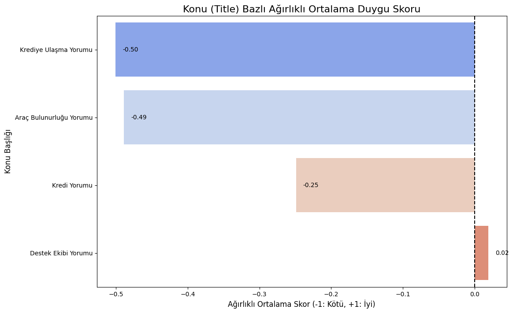
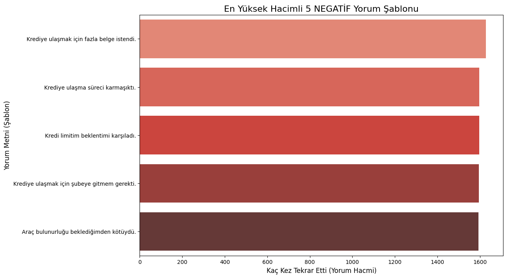
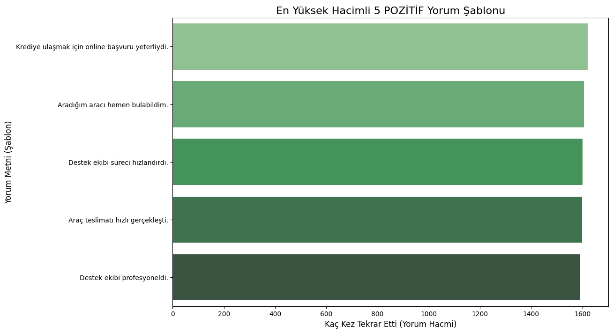
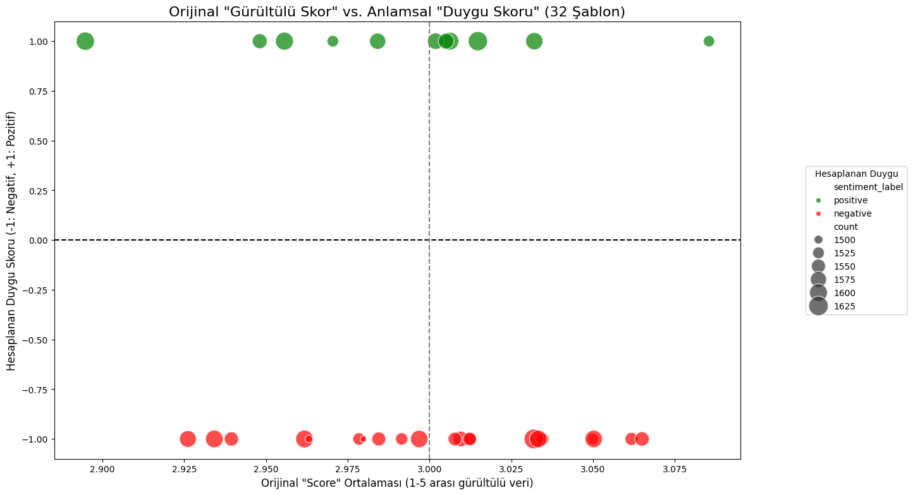

# Case Study 1– Kredi Risk Tahminleme
Bu çalışma, kredi riski modellemesi odağında hazırlanmıştır. Veri temizleme, tutarsızlıkların giderilmesi, feature engineering, modelleme, hiperparametre optimizasyonu ve model performans analizini kapsamaktadır.

Case 1 için tüm analizler ve açıklamalar, yorum satırlarıyla birlikte ayrıntılı biçimde Jupyter Notebook içinde sunulmuştur: case1_credit_risk/credit_risk_analysis_and_modeling.ipynb

# Case Study 2– Konu Bazlı Arama + Duygu Analizi + Düşük Kaynak Optimizasyonu

Bu proje, 50.000 adet müşteri geri bildiriminden oluşan büyük bir veri seti üzerinde çalışan RAG (Retrieval-Augmented) tabanlı hızlı duygu analizi asistanı sunar.

Projenin amacı:
- Belirli bir konu/anahtar kelime verildiğinde ilgili yorumları bulmak
- Bu yorumlar için duygu analizi yapmak
- Düşük donanımlı ortamlarda bile hızlı çalışacak bir yapı kurmak
- RAG ve Non-RAG yöntemlerini karşılaştırmak


## Proje Mimarisi
```DATA_SCIENTIST_CASE_STUDY/
│
├── README.md                 # Genel proje açıklaması (Case1 + Case2)
├── requirements.txt
├── .venv/
│
├── case1_credit_risk/
│   ├── credit_risk_case.xlsx
│   └── credit_risk_analysis_and_modeling.ipynb
│
├── case2_rag_sentiment/
│   │
│   ├── data/
│   │   └── musteriyorumlari.xlsx
│   │
│   ├── artifacts/
│   │   ├── temp_templates.csv
│   │   ├── df_templates_with_scores.csv
│   │   ├── faiss_template_index.idx
│   │   └── manual_rules.json
│   │
│   ├── images/
│   │   ├── image.png
│   │   ├── image-1.png
│   │   ├── image-2.png
│   │   └── image-3.png
│   │
│   ├── src/
│   │   ├── __init__.py
│   │   ├── config.py
│   │   ├── data_preprocessor.py
│   │   ├── index_builder.py
│   │   ├── rag_pipeline.py
│   │   └── app.py
│   │
│   └── rag_prototyping_anad_analysis.ipynb
```

## Kurulum
git clone <https://github.com/umutky/data-scientist-case-study.git>

cd project-folder

pip install -r requirements.txt

## Pipeline Adımları
### 1. Data Preprocessing
Çalıştır: python src/data_preprocessor.py

Bu script:
- 50.000 satırı okur
- benzersiz yorum şablonu çıkarır (Çalışma sürecinde 50000 yorumun aslında 32 temel yoruma dayandığını tespit ettiğim için yaptım, bu sayede kaynak kullanımı azaltıldı)
- Her şablonun tekrar sayısını ve ortalama puanını hesaplar
- Sonucu kaydeder: artifacts/temp_templates.csv

### 2. FAISS Index + Sentiment Skorları Üretimi
Çalıştır: python src/index_builder.py

Bu script:
	1.	savasy/bert-base-turkish-sentiment-cased modeli ile 32 şablonun duygu skorlarını hesaplar.
	2.	manual_rules.json dosyası varsa hatalı görülen etiketler düzeltilir.
	3.	sentence-transformers modeli ile template embedding’lerini çıkarır.
	4.	FAISS ile semantik arama index’i oluşturur.
	
Çıktılar:
- df_templates_with_scores.csv
- faiss_template_index.idx

**NOT**: manual_rules.json içerisien bütün eklemeler yapılmamıştır, burada amaç istenildiği zaman rule based bir yapıyla yapının kuvvetlendirilebileceğini göstermektir. Ayrıca bu yapı BERT yerine farklı modeller kullanılarak da kuvvetlendirilebilir.

### RAG Pipeline Çalıştırma
Çalıştır: python app.py

Örnek kullanım: > kredi başvurusu

Çıktılar:
- Sorguyla en alakalı şablonlar
- Her şablonun temsil ettiği yorum sayısı
- Ağırlıklı ortalama sentiment skoru
- Hızlı semantik arama sonucunda anında geri dönen analiz


## Elde Edilen İç Görüler



Burada kullandığımız pre-trained BERT modelinin, bazı cümleleri yanlış sınıflandırdığını görebilmekteyiz. Bu kurmuş olduğumuz yapıdan kaynaklı değil, BERT modelinin cümleyi yanlış sınıflandırmasından kaynaklıdır.




Yapılan analizlerde de görülmüştür ki veri seti içerisinde neredeyse her yorum için ortalama Score değeri aynıdır. Bu da aslında bu değerlerin gürültülü (noisy) olduğunun bir göstergesidir. Bu skorların yerine RAG mimarimizin sonucunda elde ettiğimiz skorların daha anlamlı olduğunu görmekteyiz.

**NOT:** Analizler, pre-trained sentiment modelinin bazı yorumları sınıflandırmada başarısız olduğu tespit edilmiştir. Bu durum rule-based iyileştirmeler veya daha gelişmiş modellerle yeniden kalibrasyon yapılarak geliştirilebilir.


## Manuel Kural Sistemi
Örnek:
{
    "override_labels": [
        {
            "contains": "beklentimi karşıladı",
            "sentiment_label": "positive",
            "sentiment_score": 1
        }
    ]
}

Bu mekanizma:
- Modelin hatalı etiketlediği şablonları düzeltmek
- Domain expert bilgisini sisteme katmak
- Üretim ortamında yüksek kontrol sağlamak.
